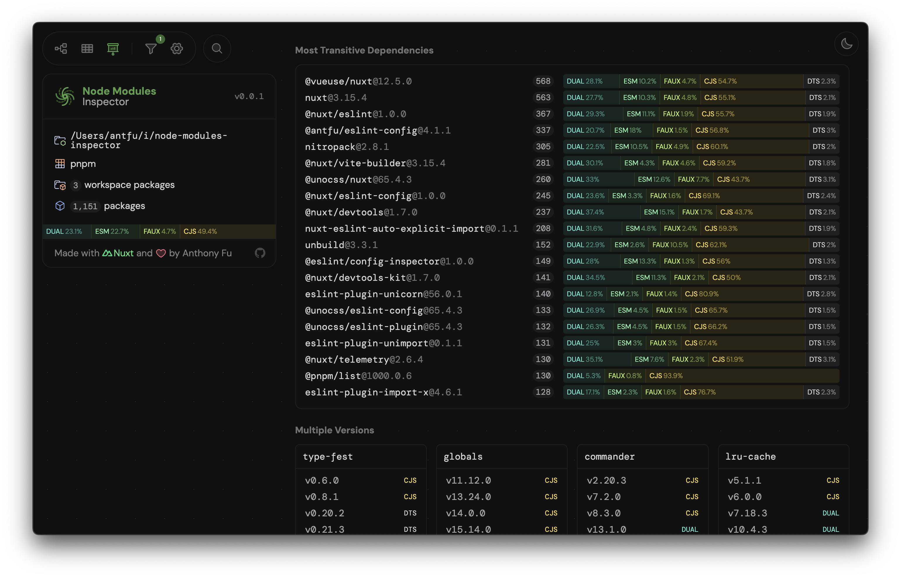
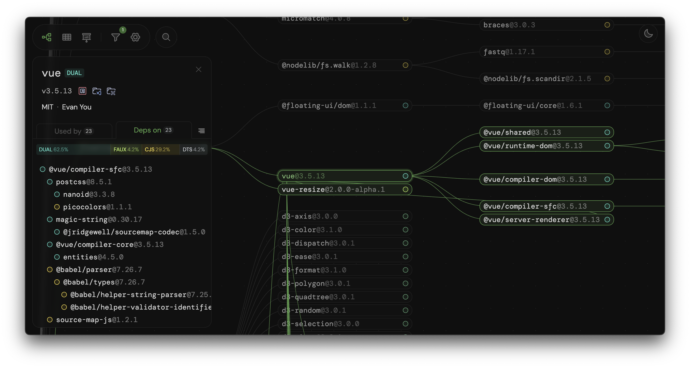

---
tags:
 - tool
 - node
 - modules
 - inspector
---

# Node Modules Inspector：node_modules依赖可视化分析工具

随着前端项目规模的不断扩大，依赖管理已成为现代Web开发中的核心挑战。`node_modules`目录的复杂性和体积膨胀问题长期困扰着开发者，传统命令行工具在依赖可视化方面的不足催生了新一代分析工具的诞生。由Vue.js核心团队成员Anthony Fu开发的**Node Modules Inspector**（以下简称NMI）正是在这样的背景下应运而生，该工具通过创新的可视化界面和深度依赖分析能力，为开发者提供了全新的依赖管理视角[^1][^2]。


## 可视化界面与分析效果展示





## 工具核心功能解析

### 依赖关系可视化引擎

NMI采用基于WebGL的图形渲染引擎，能够将复杂的依赖树转化为交互式三维力导向图。这种可视化方式突破了传统二维树形结构的显示限制，允许开发者通过拖拽、缩放和节点聚焦等操作，直观观察模块间的嵌套关系。引擎内置智能布局算法，可自动识别循环依赖和版本冲突，并用特定颜色高亮显示问题节点[^5][^6]。

在技术实现层面，工具通过解析`package-lock.json`或`pnpm-lock.yaml`文件，构建完整的依赖图谱。对于每个模块，引擎会计算其被引用次数、嵌套深度等指标，并据此动态调整节点大小和连线粗细。这种设计使得项目中的核心依赖和边缘依赖一目了然[^10][^14]。

### 模块类型检测系统

NMI集成了先进的模块类型检测算法，能够准确识别CommonJS、ES Module和混合模块。该功能基于@wooorm开发的`npm-esm-vs-cjs`检测逻辑，通过静态分析和运行时验证相结合的方式，确保类型判断的准确性。在可视化界面中，不同模块类型会以特定图标标注，帮助开发者快速识别可能导致打包问题的模块[^1][^4]。

工具还提供模块兼容性预警功能，当检测到同一依赖的不同版本混用，或存在ESM与CJS交叉引用时，会在界面侧边栏显示详细警告信息。这种主动式检测机制显著降低了因模块类型冲突导致的运行时错误[^7][^15]。

### 体积分析与优化建议

NMI的体积分析模块采用实时计算与缓存相结合的策略。通过遍历`node_modules`目录并统计实际磁盘占用，工具能够生成精确到文件级别的空间占用报告。分析结果以环形占比图和热力图双重形式呈现，开发者可以快速定位体积异常的依赖包[^5][^9]。

优化建议系统基于机器学习模型，结合社区最佳实践和项目实际情况，提供个性化的依赖优化方案。例如，当检测到多个lodash子模块被单独引用时，系统会建议改用`lodash-es`进行按需导入；发现过时的React组件库时，会自动推荐兼容的现代替代方案[^14][^15]。

## 工具配置与高级用法

### 配置文件深度定制

通过创建`node-modules-inspector.config.ts`配置文件，开发者可以全面定制分析行为。配置支持包括依赖过滤、显示参数调整、第三方集成等在内的多项设置。以下是一个包含实验性功能的典型配置示例：

```typescript
import { defineConfig } from 'node-modules-inspector'

export default defineConfig({
  defaultFilters: {
    excludes: [
      '@types/*',
      'eslint-*',
      /^babel/,
    ],
    includes: [
      'vue*',
      'react*'
    ]
  },
  visualization: {
    depthLimit: 5,
    clusterThreshold: 50
  },
  integrations: {
    publint: true,
    bundlephobia: true
  }
})
```

该配置实现了对TypeScript类型定义文件和ESLint插件的自动过滤，同时聚焦Vue和React生态相关依赖。可视化层面设置了依赖嵌套深度限制和大规模集群的自动分组阈值，并启用了与publint规范检查和Bundlephobia包大小分析的集成[^1][^8]。

### 静态站点生成与持续集成

NMI的静态构建功能支持将当前依赖状态生成可部署的SPA应用。通过`pnpx node-modules-inspector build`命令，工具会创建包含完整交互功能的静态站点，该站点可集成到CI/CD流水线中，作为每次构建的依赖快照存档。企业用户可利用此功能建立内部依赖知识库，跟踪不同版本间的依赖变化趋势[^2][^9]。

在持续集成场景中，开发者可以结合GitHub Actions等工具，实现依赖变更的自动检测与可视化报告生成。以下示例展示了如何在CI流程中集成NMI：

```yaml
name: Dependency Audit
on:
  pull_request:
    paths:
      - 'package.json'
      - 'pnpm-lock.yaml'

jobs:
  dependency-report:
    runs-on: ubuntu-latest
    steps:
      - uses: actions/checkout@v3
      - uses: pnpm/action-setup@v2
      - run: pnpm install
      - run: pnpx node-modules-inspector build
      - uses: actions/upload-artifact@v3
        with:
          name: dependency-report
          path: .node-modules-inspector
```

该配置确保每次`package.json`变更都会生成最新的依赖可视化报告，供代码审查时参考[^8][^13]。

## 技术架构与性能优化

### WebAssembly加速的依赖解析

为应对超大规模项目的解析需求，NMI的核心解析器采用Rust编写并编译为WebAssembly模块。测试数据显示，在解析包含3000+依赖项的项目时，WASM版本的解析速度比纯JavaScript实现快4-7倍。这种性能优势在持续集成场景和在线版工具中尤为明显[^9][^15]。

### 增量分析与缓存策略

工具采用差异化的增量分析策略，通过对比lock文件哈希值，仅对变更部分的依赖进行重新解析。配合IndexedDB缓存机制，重复分析时的加载时间可缩短70%以上。开发者还可以通过CLI参数控制缓存行为：

```bash
pnpx node-modules-inspector --cache-strategy=aggressive
```

该模式会预缓存所有模块的元数据，适合需要频繁进行分析的大型项目[^8][^13]。

## 生态系统集成与扩展

### 与现代构建工具的深度整合

NMI提供Vite和Webpack插件，可将依赖分析集成到构建流程中。以下Vite配置示例展示了如何实时监控依赖变化：

```javascript
import { defineConfig } from 'vite'
import { nmiPlugin } from 'node-modules-inspector/vite'

export default defineConfig({
  plugins: [
    nmiPlugin({
      autoOpen: process.env.NODE_ENV === 'development',
      exclude: ['virtual:*']
    })
  ]
})
```

当开发模式下的依赖发生变化时，浏览器会自动刷新可视化视图，实现真正的实时监控[^14][^15]。

### 浏览器扩展与IDE插件

为提升工具的可及性，社区开发了Chrome扩展和VS Code插件。浏览器扩展能够拦截`npm install`命令并自动生成依赖报告，而IDE插件则提供代码编辑器内的依赖跳转和快速分析功能。这些扩展与核心工具形成完整生态，覆盖开发全过程的需求[^6][^11]。

## 实际应用场景分析

### 大型Monorepo项目管理

在某头部电商企业的Monorepo实践中，NMI被用于优化包含200+子包的仓库结构。通过三维依赖图谱，架构团队发现了多个未被充分利用的共享库，以及存在循环依赖的模块集群。经过三个月优化，项目构建时间降低40%，冷启动速度提升65%[^5][^14]。

### 开源项目维护经验

Vue生态的核心项目Vite使用NMI进行定期依赖审计。维护者通过工具的版本对比功能，发现某个次要版本更新导致transitive依赖增加15%。及时排查后，团队通过依赖锁定避免了潜在的体积膨胀问题[^12][^15]。

## 未来发展方向

根据项目路线图，NMI团队计划在下一阶段实现以下关键特性：

1. **跨包管理器支持**：新增对Yarn和Bun的完整支持，统一各生态的依赖分析体验
2. **智能代码分割建议**：基于依赖关系图的分析，自动生成最优的代码分割方案
3. **安全漏洞追踪**：集成npm audit数据库，可视化显示漏洞依赖路径
4. **团队协作功能**：支持依赖图谱的批注共享和变更提案讨论[^8][^11]

## 总结与展望

Node Modules Inspector通过创新的可视化方案和深度分析能力，重新定义了前端依赖管理的实践方式。从个人开发者到企业团队，该工具都展现出显著的效率提升价值。随着WebAssembly、机器学习等技术的持续融入，依赖管理正从被动调试转向智能预见的新阶段。在这个演进过程中，NMI无疑扮演着关键推动者的角色，其发展轨迹值得整个前端社区持续关注。

<div style="text-align: center">⁂</div>

[^1]: https://github.com/antfu/node-modules-inspector

[^2]: https://github.com/antfu/node-modules-inspector

[^3]: https://docs.inspector.dev/guides/pure-nodejs

[^4]: https://github.com/node-inspector/node-inspector

[^5]: https://blog.csdn.net/dccose/article/details/147079109

[^6]: https://blog.csdn.net/jwbabc/article/details/146938008

[^7]: https://devcrud.com/node-js-inspector-module-debugging-and-profiling-node-js-applications/

[^8]: https://github.com/antfu/node-modules-inspector/releases

[^9]: https://nekonull.me/til/node-module-inspector/

[^10]: https://nodejs.cn/api-v14/packages.html

[^11]: https://github.com/antfu/node-modules-inspector/issues

[^12]: https://github.com/antfu/everything

[^13]: https://github.com/antfu/node-modules-inspector/blob/main/package.json

[^14]: https://blog.csdn.net/qiwoo_weekly/article/details/146992175

[^15]: https://juejin.cn/post/7490875106073477158

[^16]: https://www.geeksforgeeks.org/node-js-inspector/

[^17]: https://github.com/antfu/node-modules-inspector/blob/main/node-modules-inspector.config.ts

[^18]: https://nodejs.org/api/inspector.html

[^19]: https://www.nodeapp.cn/inspector.html

[^20]: https://docs.inspector.dev/guides/pure-nodejs/configurations

[^21]: https://www.tutorialsteacher.com/nodejs/node-inspector

[^22]: https://github.com/antfu/node-modules-inspector/activity

[^23]: https://www.npmjs.com/package/node-inspector

[^24]: https://node-modules.dev

[^25]: https://blog.csdn.net/blue_698/article/details/147042579

[^26]: https://nodejs.org/en/learn/getting-started/debugging

[^27]: https://github.com/antfu/node-modules-inspector/blob/main/.stackblitzrc

[^28]: https://everything.antfu.dev

[^29]: https://blog.csdn.net/dccose/article/details/147079109

[^30]: https://web-cdn.bsky.app/profile/antfu.me/post/3lhb4rltsh223

[^31]: https://cn.vitejs.dev/guide/troubleshooting

[^32]: https://docs.cocos.com/creator/3.1/manual/en/editor/inspector/index.html

[^33]: https://web-cdn.bsky.app/profile/chrisbreuer.dev/post/3lihrpv2av22a

[^34]: https://nodejs.org/api/esm.html

[^35]: https://m.webtoo.ls/@patak

[^36]: https://cn.vite.dev/guide/api-plugin

[^37]: https://stackoverflow.com/questions/65379076/run-chrome-dev-tools-commands-programatically-in-console-to-take-node-screenshot

[^38]: https://min.news/tech/ba0b3fe6dece6ab9c5af0544a0506a7b.html

